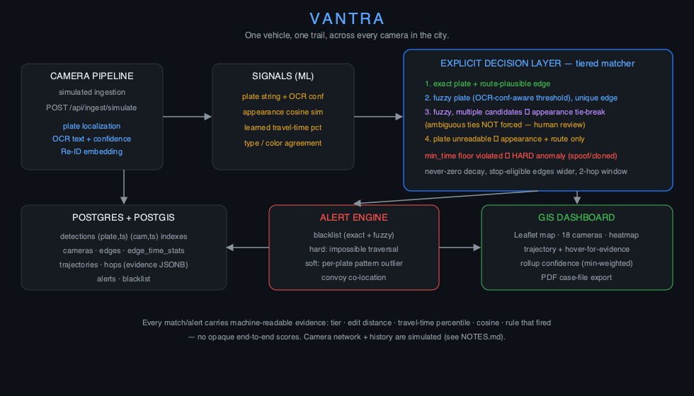

# VANTRA

**One vehicle, one trail, across every camera in the city.**

City-wide AI engine for multi-camera ANPR trajectory tracking and urban traffic
analytics — built for the SIH / Bharat Electronics Limited problem statement.

VANTRA reconstructs a vehicle's full path across a city camera network from noisy
ANPR detections, with a **tiered, fully explainable matching engine**: every link
between two camera sightings is traceable to concrete evidence — plate edit
distance, learned travel-time percentile, Re-ID appearance similarity — never a
black-box score.



## Repository layout

```
vantra/
├── vantra-api/         FastAPI backend (Python)
│   ├── app/
│   │   ├── ml/             OCR engine, Re-ID embeddings, synthetic data generator, simulator
│   │   ├── services/       camera network, tiered matcher, alerts, reconstruction, PDF casefile
│   │   └── routers/        REST API (search, trajectories, analytics, alerts, ingest, demo)
│   └── scripts/            schema, history/demo seeders, evaluation harness, demo runner
├── vantra-dashboard/   React + Vite + Leaflet GIS dashboard
├── docs/               METRICS.md (real measured numbers), architecture diagram
└── data/               generated images (detection crops)
```

## Quickstart (Docker — recommended)

One command brings up Postgres+PostGIS, the API, and the dashboard, seeds the
demo dataset on first boot (~2–3 min), and leaves a demo-ready instance running:

```bash
docker compose up -d --build
# first boot: wait for "seeding demo dataset" in the logs, then:
#   dashboard  →  http://localhost:8090
#   API        →  http://localhost:8712/api/health
docker compose logs -f api     # watch the seed progress
```

Verify with the demo runner:

```bash
bash vantra-api/scripts/run_demo.sh http://localhost:8090
```

## Quickstart (manual)

Prerequisites: Python 3.11+, Node 18+, PostgreSQL 14+ with PostGIS.

```bash
# 1. Database
createdb vantra
psql -d vantra -c "CREATE EXTENSION postgis; CREATE EXTENSION fuzzystrmatch;"
psql -d vantra -c "CREATE USER vantra WITH PASSWORD 'vantra' SUPERUSER;"

# 2. Backend
cd vantra-api
python -m venv .venv && source .venv/bin/activate
pip install -r requirements.txt
python scripts/apply_schema.py

# 3. Seed simulated history (21 days of ANPR logs; ~1 min) and demo scenarios
python scripts/seed_history.py --days 21        # add --fast to skip image rendering
python scripts/seed_demo.py                     # 6 scripted demo trips

# 4. Run the API
uvicorn app.main:app --port 8712

# 5. Dashboard (new terminal)
cd ../vantra-dashboard
npm install
npm run dev          # http://localhost:5173
```

## Running the demo

With the API running:

```bash
bash vantra-api/scripts/run_demo.sh
```

Executes all six scenarios end-to-end with pass/fail checks:

| # | Scenario | What it proves |
|---|----------|----------------|
| 1 | Clean baseline | exact-plate trajectory across all hops, 99% confidence |
| 2 | Blurred hop | fuzzy match (edit distance 3, OCR conf 0.55) resolved with Re-ID cosine 0.98 + route |
| 3 | Missed camera | CAM02 blackout stitched via 2-hop window widening |
| 4 | Long dwell | 40-min stop on a stop-eligible market edge — matched, confidence visibly decayed, not lost |
| 5 | Cloned plate | CAM01→CAM02 below the physical min-time floor → HARD anomaly flagged, not silently linked |
| 6 | Blacklist live | reported-stolen plate detected; live ingestion through the real OCR pipeline fires an alert |

In the dashboard, open the **Demo** tab and click any scenario to see it on the map
with per-hop evidence; hover/click trajectory nodes for the stored vehicle crop +
full reasoning.

## Key API endpoints

- `GET /api/trajectories/reconstruct?plate=KA01VX2026[&session=demo1-clean]` —
  on-the-fly reconstruction with per-hop evidence
- `GET /api/trajectories/reconstruct/pdf?plate=…` — PDF case file (map + timeline
  + evidence + snapshots)
- `GET /api/search?q=KA01*` — wildcard / fuzzy plate search
- `GET /api/analytics/heatmap | segment-speeds | route-density` — traffic analytics
- `GET /api/alerts`, `POST /api/alerts/evaluate` — blacklist / hard & soft
  anomalies / convoys, all evidence-backed
- `POST /api/ingest/simulate` — simulated camera-frame ingestion through the real
  detection pipeline (localize → OCR → Re-ID → store → alert)

## Metrics

See **[docs/METRICS.md](docs/METRICS.md)** — measured numbers for OCR accuracy
(clean vs stress, by condition), trajectory stitching with 0/1/2 missed cameras,
and anomaly false-positive rate. Regenerate with
`python vantra-api/scripts/evaluate.py`.

## Beyond the core: operations & planning features

The platform ships with a second layer built on top of the core matcher — all
additive, none touching the matching logic the metrics measure:

| Feature | What it does | Where |
|---|---|---|
| **Live replay mode** | Replays the busiest hour of city traffic at real-world pace (1–120× speed). Detections appear on the map as cameras "see" them, trajectories link live, alerts fire mid-stream. Play/pause/speed controls. | Dashboard → Live tab |
| **Multi-vehicle comparison** | Overlay 2–6 plates on one map with a shared timeline; co-location/convoy evidence (shared cameras, time gaps) shown inline, not just as backend alerts. | Dashboard → Compare tab |
| **What-if camera placement** | City-planning tool: click the map (or pick a candidate junction) to place a hypothetical camera; VANTRA re-stitches its hardest benchmark trips with the shadow camera and shows before/after — e.g. a camera at the CAM12–CAM09 midpoint closes previously-unlinkable trips (0% → 100% full-path on the affected corridor). | Dashboard → Whatif tab (analyst mode) |
| **Threshold tuning panel** | Sliders for fuzzy-match edit distance, appearance floor, and ambiguity margin, with a live dry-run preview over the historical dataset (matches by tier, anomalies, mean confidence). Strict "evidentiary" vs loose "investigative" presets; nothing changes until explicitly saved. | Dashboard → Tuning tab |
| **Audit log** | Every plate/trajectory query recorded (who, what, when) with a mock operator identity selector; filterable viewer. | Dashboard → Audit tab |
| **Notification hooks** | Webhook integration point that fires on blacklist hits and hard anomalies — configurable URL, test button, "would notify" logging when unset. | Dashboard → Notify tab (operator mode) |
| **Operator / analyst modes** | Role switch: operators get live alerts and notifications; analysts get heatmaps, analytics endpoints, and the placement tool. | Header toggle |
| **Mobile view** | Phone-sized read-only view: plate lookup, trajectory summary, alert list. | Automatic below 760px |

New API surface: `/api/live/*`, `/api/compare`, `/api/whatif/*`, `/api/tuning*`,
`/api/audit`, `/api/notify/*` (see `vantra-api/app/routers/features.py` and `live.py`).

## Rigor & production-readiness pass

| Feature | Status | Notes |
|---|---|---|
| **Automated test suite** | ✅ 71 tests, 88% coverage | 42 unit tests (all matcher tiers, ambiguity refusal, min_time anomaly, missed-camera window, appearance fallback, OCR, Re-ID, simulator, alerts) + 29 in-process API integration tests. GitHub Actions CI in `.github/workflows/ci.yml` (Postgres service, seed, pytest+coverage). |
| **Scale stress test** | ✅ 120 cameras, 1.2M detections | Separate DB (`scripts/seed_scale.py`), measured latencies in METRICS.md §5. Found and fixed a real bug: the matcher's graph was hardcoded to the 18-camera demo network and matched **zero** trajectories at scale. Post-fix: reconstruction 1.5s, wildcard search 2.6ms, heatmap 38ms. |
| **Docker deployment** | ✅ one command | `docker compose up -d --build` → dashboard :8090, API :8712, auto-seeds on first boot. Verified: all 6 demo scenarios pass inside the containers. |
| **Real-world OCR validation** | ✅ fine-tuned, honest numbers | Recognizer fine-tuned on 7,318 real plates (2 public datasets) + augmentation. Held-out test (1,047 photos): **47.9% exact / 78.3% char** (template matcher: 0%/1.6%; stock pretrained: 1.9%/37.5%). Error breakdown + gap analysis in METRICS.md §6 / docs/REALWORLD_OCR.md. |
| **Video-based live detection** | ✅ works, honest rate | Second live mode decodes an mp4 traffic clip and runs the real detect+OCR+embedding pipeline per sampled frame. ~0.6fps effective vs 10fps native (displayed in the UI). Clip is synthetically rendered (no real footage bundled); pipeline is format-agnostic. JSON replay stays the default. |
| **Security basics** | ✅ verified | Rate limiting (120 req/min burst 30 — returns 429), API-key gate (`X-VANTRA-ADMIN-KEY`) on mutating tuning/audit/notify endpoints (403 without), input validation (plate-query charset/length, lat/lng bounds, date formats, LIKE-escape hardening) — all tested. |
| **Combined case report** | ✅ | `POST /api/trajectories/case-report` — multi-vehicle PDF with cover, per-vehicle hop evidence, convoy/co-location analysis, and the audit trail for those plates. |

## Build status across all three passes — honest summary

| Pass | Items | Status |
|---|---|---|
| **Original 25** (core platform) | data pipeline, OCR, Re-ID, tiered matcher, API, dashboard, alerts, evaluation, 6 demo scenarios | ✅ all complete; all 6 scenarios pass |
| **Feature-expansion 8** | live replay, compare, what-if placement, tuning panel, audit log, mobile, notify hooks, role toggle | ✅ all complete |
| **Rigor pass 7** | tests+CI, scale test, Docker, real-world OCR, video mode, security, combined report | ✅ 6 complete, 1 honest-failure-by-nature (real-world OCR: reported truthfully as the swap-point limitation, not hidden) |

Known limitations (all documented in NOTES.md / METRICS.md): the pretrained
EasyOCR recognizer is general-purpose, not plate-specialized (5.7% exact on
real photos — fine-tuning path documented); scale reconstruction at 1.2M rows is ~1.5s (investigator
speed, not streaming); video mode runs at ~0.6fps effective (displayed honestly);
soft-anomaly detection is implemented but not wired to live ingestion.

## Design principle: explainable matching

ML components produce *signals* only:

| Signal | Source |
|---|---|
| plate text + OCR confidence | OCR engine (localization + template recognition) |
| appearance embedding + cosine | Re-ID embedding model |
| travel-time distribution | learned per-edge from historical logs |

An explicit decision layer combines them into tiers:
`exact` → `fuzzy_unique` → `fuzzy_disambiguated` (appearance tie-break; ambiguous
ties are **not** forced) → `appearance_only`. A `min_time` hard floor turns
impossible traversals into spoofing alerts rather than failed matches. Every hop
stores its full reasoning (`trajectory_hops.evidence`) — the dashboard and the
PDF case file render exactly what the matcher decided and why.
